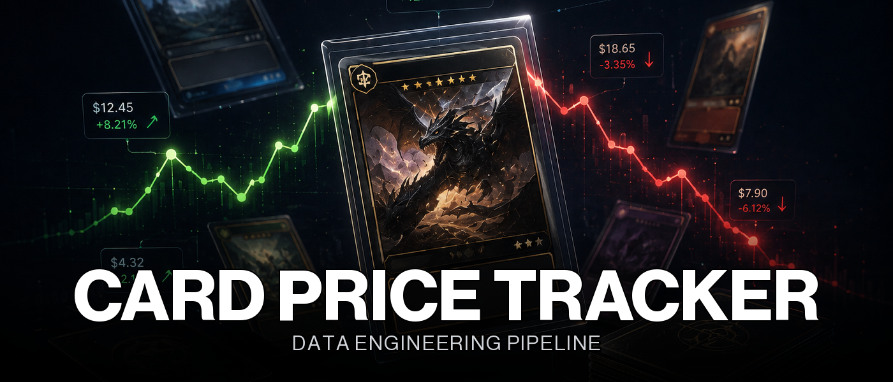

<div align="center">
  

  <p>
    <b>An end-to-end data pipeline that tracks daily Pokemon card prices across two market platforms, resolves an unreliable third-party API into a trustworthy star schema, and serves the result through both a shared BI tool and a purpose-built dashboard, running unattended in production on a self-hosted VPS.</b>
  </p>

  <p>
    
    
    
    
    
  </p>

  <p>
    
    
    
    
    
    
    
    
    
  </p>
</div>


<a name="overview"></a>
<h2 align="center">Overview</h2>

<div align="center">

Every day, an Apache Airflow DAG extracts the full Pokemon card catalog from [pokemontcg.io](https://pokemontcg.io) (roughly 80 paginated calls, around 20,000 cards, which relays pricing from both TCGPlayer and CardMarket), validates and cleans it into a staging layer with an explicit quarantine for rejects, then loads it into a PostgreSQL star schema. A second, independent import path lets the owner's personal collection (a CSV export from a third-party portfolio tool) be matched against that same catalog. The result is queried two ways: a shared Metabase instance for open-ended exploration, and a purpose-built FastAPI and React dashboard for four specific views (catalog search, collection value, per-card history, and daily/weekly price movers). Both read through the same read-only database role, never through the pipeline's own.

The interesting part isn't calling one API and writing rows to a table. It's building resilience against a third-party API measured at roughly 37% transient failure (5xx and timeouts) on a full extraction, so a page-level checkpoint has to survive crashes without ever losing already-fetched pages or duplicating them. It's a real production incident on 2026-08-07, where a prolonged outage exhausted the retry budget mid-run, diagnosed from execution logs and fixed by raising the retry ceiling, capping the DAG's cumulative duration separately from any single attempt, and catching a date-rollover bug that could have silently corrupted the checkpoint. It's discovering mid-project that the underlying market had effectively shifted from CardMarket to TCGPlayer and having to model that as a currency-aware dimension rather than mixing EUR and USD in the same aggregates. None of this shows up in a demo, only in what breaks in production and how it gets diagnosed (see [Production Hardening](#production-hardening)).

</div>


<a name="highlights"></a>
<h2 align="center">Highlights</h2>

This isn't a script that fetches an API once and calls it done. A handful of decisions separate that from a pipeline that runs unattended, every day, against a source that fails roughly one call in three:

- **Idempotent end-to-end, proven rather than assumed.** Every layer, from the raw copy to the staging quarantine to the star schema itself, upserts through a `UNIQUE` constraint instead of a delete-and-reload. [`tests/test_idempotence.py`](tests/test_idempotence.py) replays the entire pipeline twice in a row against a real database and asserts zero duplication and zero drift in the historical record.
- **A page-level checkpoint turns a ~37% failure rate into a non-issue.** Each successfully fetched page commits immediately in [`src/extract/pipeline.py`](src/extract/pipeline.py), so a crash mid-extraction never loses work already done; a retry resumes from the last confirmed page instead of restarting an 80-page extraction from scratch.
- **A real incident reshaped the DAG's failure handling, not a hypothetical one.** The automated run of 2026-08-07 exhausted its then-20-retry budget during a prolonged `pokemontcg.io` outage. The fix, documented in [`docs/superpowers/specs/2026-08-08-dag-reliability-design.md`](docs/superpowers/specs/2026-08-08-dag-reliability-design.md), raised the retry ceiling to 60, added a 4-hour `dagrun_timeout` that bounds the cumulative run rather than any single attempt, and closed a UTC date-rollover bug, then was verified by replaying that exact failed run to `success` in production.
- **Least privilege is enforced at the database role level, not just documented.** `pipeline_app` (read/write, scoped to the schemas the pipeline needs) and `dashboard_reader` (read-only, scoped to `prod` alone) are two separate Postgres roles: no interface capable of exploring the data, whether Metabase or the custom dashboard, can also write to it.


<a name="architecture"></a>
<h2 align="center">Architecture</h2>

```text
pokemontcg.io API (TCGPlayer + CardMarket pricing)
    -> extract_and_load_raw     page-level checkpoint, resumes after failure
raw.card_prices                 raw copy (full JSON payload, traceable)
    -> clean_to_staging          validation + cleaning
staging.card_prices              valid, typed cards
staging.card_prices_quarantine   rejected cards + explicit reason
    -> load_to_warehouse
prod.fact_price_history         star schema, price by card / day / platform
prod.dim_card / dim_date / dim_platform   (currency: EUR for CardMarket, USD for TCGPlayer)
    -> dashboard_reader (read-only)
        -> Metabase                shared BI instance
        -> dashboard-api + frontend  purpose-built FastAPI + React dashboard
```

- **Apache Airflow** (LocalExecutor) is the only orchestrator. The daily DAG in [`dags/card_price_pipeline_dag.py`](dags/card_price_pipeline_dag.py) chains three tasks, `extract >> clean >> load`, each wrapped in its own Postgres transaction.
- **PostgreSQL** is the single source of truth, running as its own service in [`docker-compose.yml`](docker-compose.yml), never shared with another project on the host.
- **A personal collection import path** ([`src/load/collection_loader.py`](src/load/collection_loader.py), [`src/transform/collection_match.py`](src/transform/collection_match.py)) matches an external CSV against `prod.dim_card` into `prod.dim_owned_card`, with its own quarantine for rows that fail to match any known set or card.
- **Two read-only consumers, one shared role.** Metabase and a custom FastAPI + React dashboard ([`src/api/`](src/api), [`frontend/`](frontend)) both connect through `dashboard_reader`, never through the pipeline's own `pipeline_app` role.


<a name="data-model"></a>
<h2 align="center">Data Model</h2>

<div align="center">

| Layer | Tables | Purpose |
| --- | :---: | --- |
| Raw | 1 | Untouched API payload, full traceability |
| Staging | 2 | Typed and validated, plus an explicit quarantine |
| Production | 4 | Star schema: 1 fact table, 3 dimensions |
| Personal Collection | 3 | Owned cards, matched against the catalog |

</div>

<table width="100%">
<tr><th width="24%">Table</th><th>Role</th></tr>
<tr><td colspan="2" align="right"></td></tr>
<tr><td align="center"><code>raw.card_prices</code></td><td>Full, untouched API response per card and per day, kept for traceability and to allow the pipeline to be replayed if a downstream bug is ever found.</td></tr>

<tr><td colspan="2" align="right"></td></tr>
<tr><td align="center"><code>staging.card_prices</code></td><td>Cleaned, typed rows that passed validation (well-formed price, known card identifier).</td></tr>
<tr><td align="center"><code>staging.card_prices_quarantine</code></td><td>Rejected rows with an explicit reason, upserted idempotently since <a href="migrations/004_add_quarantine_unique_constraint.sql"><code>migration 004</code></a> so a retried cleaning task never duplicates a rejection.</td></tr>

<tr><td colspan="2" align="right"></td></tr>
<tr><td align="center"><code>prod.dim_card</code></td><td>One row per unique card (name, set, rarity), updated in place as the source reveals new attributes, no history kept here by design.</td></tr>
<tr><td align="center"><code>prod.dim_date</code></td><td>Pre-populated calendar dimension (year, month, day, day of week) so BI aggregations avoid computing date parts per row.</td></tr>
<tr><td align="center"><code>prod.dim_platform</code></td><td>TCGPlayer and CardMarket, each with its own <code>currency</code> column (added in <a href="migrations/006_add_currency_to_dim_platform.sql"><code>migration 006</code></a>) so a query never silently sums EUR and USD together.</td></tr>
<tr><td align="center"><code>prod.fact_price_history</code></td><td>One row per card, per day, per platform. The single grain the entire dashboard and reporting layer is built on.</td></tr>

<tr><td colspan="2" align="right"></td></tr>
<tr><td align="center"><code>collection.raw_import</code></td><td>Rows from the owner's external CSV export that passed the initial import filters, before matching against the catalog.</td></tr>
<tr><td align="center"><code>collection.match_quarantine</code></td><td>Import rows whose set or card could not be matched to <code>prod.dim_card</code>, with the rejection reason kept alongside a reference to the original row.</td></tr>
<tr><td align="center"><code>prod.dim_owned_card</code></td><td>Successfully matched, owned cards with quantity, the table every collection view and price-mover report is built on.</td></tr>
</table>

> [!NOTE]
> **Two pricing platforms coexist by design.** Historical CardMarket data is never deleted (the schema forbids any `DELETE` on `fact_price_history`); TCGPlayer simply became the default source after a documented mid-project design change ([`docs/superpowers/specs/2026-08-07-tcgplayer-pricing-source-design.md`](docs/superpowers/specs/2026-08-07-tcgplayer-pricing-source-design.md)). The `currency` column on `dim_platform` is what keeps a careless aggregation from mixing euros and dollars.


<a name="dashboard"></a>
<h2 align="center">Dashboard</h2>

The warehouse is read two different ways, both through the same read-only `dashboard_reader` role and never through the pipeline's own:

- **Metabase**, a shared, self-hosted instance, for open-ended exploration of the star schema without writing a custom UI for every question.
- **A purpose-built dashboard** ([`src/api/`](src/api), a FastAPI service, and [`frontend/`](frontend), a React and TypeScript single-page app) scoped to four concrete views instead of free exploration: a searchable card catalog, the owner's collection with current market value, per-card price history, and daily (7-day) / weekly (30-day) reports of the biggest movers in the owned collection.

```bash
GET /api/health                    # liveness probe, never touches the database
GET /api/cards                     # search + filter the full catalog (name, series, set, rarity, price range)
GET /api/cards/{card_id}/history   # full price history for one card
GET /api/collection                # owned cards with market value and gain/loss
GET /api/collection/movers         # daily/weekly biggest price movers, owned cards only
```

> [!TIP]
> **Movers are computed on the fly, not pre-aggregated.** The daily (7-day) and weekly (30-day) windows deliberately differ so the two reports never show the same thing, and both run as a plain SQL query against `fact_price_history` at request time. At a few hundred owned cards, this stays well within the budget for a synchronous request, so no new Airflow task or pre-computed table was introduced just for this feature.


<a name="build--run"></a>
<h2 align="center">Build & Run</h2>

Requires Docker, Docker Compose, and Python 3.11+.

```bash
cp .env.example .env
# fill in .env: Postgres passwords, pokemontcg.io API key, Airflow secrets (see comments in the file)

python3 -m venv .venv && source .venv/bin/activate
pip install -e ".[dev]"

docker compose up -d db
./scripts/apply_migrations.sh

python -m scripts.run_extract_load   # one-off manual extraction

docker compose up -d airflow-db airflow-init
docker compose up -d airflow-webserver airflow-scheduler
# Airflow UI: http://localhost:8080
```

> [!IMPORTANT]
> **The migrations only create the schema, never data.** `search_profiles`-style manual seeding does not apply here, but the personal collection tables stay empty until a CSV is imported through `scripts/import_collection.py`; the pipeline itself needs no manual seeding to start extracting prices.


<a name="production-hardening"></a>
<h2 align="center">Production Hardening</h2>

A few of the constraints and trade-offs that only became visible once the pipeline was actually running unattended against an unreliable third-party API, not while reviewing the extraction logic in isolation.

> [!CAUTION]
> **A prolonged outage once exhausted the entire retry budget mid-run.** The automated run of 2026-08-07 hit 500/502 errors across shifting pages (1, 28, 49) for 21 straight attempts and never finished the ~80-page extraction with a then-20-retry ceiling. Fixed by raising retries to 60 (measured at roughly 74 seconds per attempt, so a worst case stays bounded at 1 to 3 hours), adding a 4-hour `dagrun_timeout` on the DAG itself (distinct from a per-attempt `execution_timeout`, which resets on every retry and bounds nothing cumulative), and fixing a bug where a retry sequence crossing UTC midnight could have shifted `extracted_date` mid-checkpoint. Verified by replaying the exact failed run to `success` in production.

> [!WARNING]
> **`retries=60` lives on the extraction task alone, not on the whole DAG.** `clean_to_staging` and `load_to_warehouse` are local, deterministic SQL operations against a database that is always reachable; if either fails, it is almost certainly a real bug, not network noise, so both keep a modest `retries=2` rather than hiding a genuine failure behind dozens of silent retries.

> [!NOTE]
> **Least-privilege database roles exist and are actually enforced.** `pipeline_app` (read/write, scoped to `raw`/`staging`/`prod`/`collection`) and `dashboard_reader` (read-only, scoped to `prod` alone, see [`migration 007`](migrations/007_create_dashboard_reader_role.sql)) are genuinely separate Postgres roles with distinct passwords; no BI tool or dashboard connection can write to the warehouse it reads from.
>
> The VPS firewall never opens Postgres (5432) or Airflow (8080) publicly, only SSH (see [`infra/ovh_vps_setup.md`](infra/ovh_vps_setup.md)); every internal service stays bound to `127.0.0.1`, and the actual production access is exclusively through the Tailscale tailnet (see [Deployment](#deployment)), not database-level restriction alone.

> [!TIP]
> **Metabase's second Docker network once resolved to the wrong database.** In production, the `metabase` container also joins a second, shared Docker network used by another project on the same host, which happens to alias its own Postgres container as `db` too. A container attached to two networks with the same alias on both sides gets an ambiguous DNS resolution for that alias, and Metabase could intermittently connect to the wrong project's database, surfacing as password authentication failures despite a correct password. Fixed by pointing Metabase's connection at the full, unique container name instead of the short alias.


<a name="repository-structure"></a>
<h2 align="center">Repository Structure</h2>

```text
src/
  extract/      pokemontcg.io API client, retry/backoff, page-level checkpoint
  transform/    validation, cleaning, and collection-to-catalog matching (pure functions, no DB needed)
  load/         idempotent loading: raw, staging, quarantine, warehouse, owned collection
  api/          FastAPI dashboard backend, read-only (dashboard_reader role)
  common/       configuration and database connection helpers
dags/           Airflow DAG (extract >> clean >> load), production reliability hardening
frontend/       React + TypeScript dashboard (catalog, collection, card history, movers reports)
migrations/     Numbered SQL, applied once, never modified after merge
scripts/        Manual entry points (one-off extraction, migrations, collection import)
tests/          73 tests, unit and integration (pytest + a real Postgres instance)
infra/          VPS provisioning runbook (SSH hardening, firewall, Docker, deployment)
docs/superpowers/  Design specs and implementation plans for every major evolution
```


<a name="deployment"></a>
<h2 align="center">Deployment</h2>

Self-hosted on an OVH VPS (Ubuntu 24.04), provisioned and hardened as documented in [`infra/ovh_vps_setup.md`](infra/ovh_vps_setup.md): SSH key-only authentication, no root login, and a firewall that exposes SSH alone. Every other service, Airflow, Metabase, and the custom dashboard, is reachable exclusively over the Tailscale tailnet with a Let's Encrypt certificate issued for the VPS's MagicDNS name, never on the public interface.

```bash
ssh <vps-alias>
git clone git@github.com:Nesplee/card-price-tracker.git && cd card-price-tracker
cp .env.example .env   # fill in every value, never committed

docker compose -f docker-compose.prod.yml up -d
./scripts/apply_migrations.sh docker-compose.prod.yml
```

Application code (`src/`, `dags/`) is bind-mounted into the already-running Airflow containers, so a routine update is a plain `git pull`, no rebuild or restart needed for the next DAG run to pick it up. A rebuild is only required when `docker-compose.prod.yml` itself changes.


<a name="tests"></a>
<h2 align="center">Tests</h2>

```bash
docker compose up -d db      # integration tests need a real Postgres instance
pytest
ruff check .
black --check .
```

73 tests covering retrying extraction ([`tests/test_extract.py`](tests/test_extract.py)), checkpoint resumption ([`tests/test_run_extract_load.py`](tests/test_run_extract_load.py)), validation and cleaning ([`tests/test_transform.py`](tests/test_transform.py)), idempotent loading at every stage ([`tests/test_raw_loader.py`](tests/test_raw_loader.py), [`test_staging_loader.py`](tests/test_staging_loader.py), [`test_warehouse_loader.py`](tests/test_warehouse_loader.py)), personal collection matching ([`tests/test_collection_match.py`](tests/test_collection_match.py), [`test_collection_loader.py`](tests/test_collection_loader.py)), the dashboard API ([`tests/test_api_main.py`](tests/test_api_main.py), [`test_api_queries.py`](tests/test_api_queries.py)), and a full end-to-end idempotence run ([`tests/test_idempotence.py`](tests/test_idempotence.py)). CI ([`.github/workflows/ci.yml`](.github/workflows/ci.yml)) rebuilds a disposable Postgres and replays the entire suite on every push and pull request against `main`.


<div align="center">

<sub>Personal project · In production since August 2026</sub>

</div>
